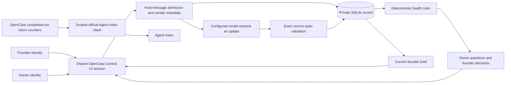

# Architecture and data flow

Delivery Lens has one OpenClaw workspace, six narrow delivery tools and the core inline widget renderer, and one local SQLite database. It does not need a separate web application.

`delivery_record` admits the current user's request and reads the record. Creation, joining, correction, and decision writes happen here using the host's current message, never model-generated mutation arguments. `delivery_update` extracts facts from only that turn's source. `delivery_checkin` queues owner questions and returns new questions for the agent to ask. `delivery_brief` assesses the current record and renders the founder brief.

The store preserves original free-form statements, contributor identity, source hash, session and admission receipt, extracted fields, and interpretation. Project revisions and correction events retain history. A correction changes the current record and withdraws its earlier interpretation. The original statement remains available in `delivery_record`.

Rules flag baseline dates that have passed, target dates later than baseline, open blockers, missing owners, stale updates, repeated target rollover, conflicting completion statements, overdue recovery, unanswered questions, and baseline variance. Unstated actuals or absent baselines prevent variance calculations. Health can remain unknown; source-backed red issues still take precedence when other information is incomplete.

A recovery plan records an action and date. It answers the recovery question without automatically clearing the blocker. Answered recovery questions are suppressed. Overdue recovery or unanswered questions appear as founder escalations. This MVP posts questions in the shared conversation. It does not claim a push notification or private message was delivered.

All people on an installation belong to the same trust boundary. Use a separate installation, data directory, gateway identity, and model credentials for another team that must not read this team's data. Customer aliases are not tenant boundaries.

The optional weekly automation runs a genuine project check-in through OpenClaw. It has no external delivery route. The five-minute usage reporter uploads only the day, model, and token counters, plus the official client's install identity. Tests never post usage.

## Version compatibility

The Control UI identity adapter in `plugin/src/identity.mjs` is pinned to the OpenClaw 2026.9.5 transcript schema. It reads the exact current session/run message in read-only mode because that runtime's plugin tool context omits the Control UI profile. This is a compatibility dependency, not a new authentication system or a tenant boundary. Channel attribution uses the runtime sender field. Unknown profiles fail closed for mutations. Test `DELIVERY WHOAMI` after any runtime upgrade.
